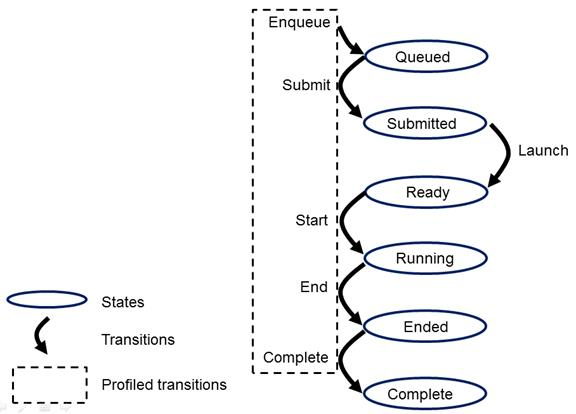

# 3.2 执行模型
OpenCL执行模型是根据两个不同的执行单元定义的：在一个或多个OpenCL设备上执行的内核程序（Kernel）以及在主机上执行的主机程序(host program)。对于OpenCL，Kernel是发生与计算相关的“工作”的地方。这项工作是通过在组（work-group）中执行的工作项(work-item)进行的。

内核在主机管理明确定义的上下文中执行。上下文定义了内核执行的环境。它包括以下资源：
- 设备（Devices）：OpenCL平台开放的一个或多个设备。
- 内核对象(Kernel Object)：OpenCL的功能及其在OpenCL设备上运行的关联参数值。
- 程序对象(Program Object)：实现内核的源程序和可执行文件。
- 内存对象(Memory Object)：主机和OpenCL设备可见的变量。内核实例在这些对象执行时对其进行操作。

主机程序使用OpenCL API创建和管理上下文。 OpenCL API中的功能使主机可以通过命令队列（command-queue）与设备进行交互。每个命令队列都与单个设备关联。放入命令队列的命令属于以下三种类型之一：
- 内核队列命令（Kernel-enqueue commands）：内核入队以在设备上执行。
- 内存命令（memory commands）：在主机和设备内存之间，内存对象之间或从主机地址空间映射和取消映射内存对象之间传输数据。
- 同步命令（Synchronization commands）：显式同步点，用于定义命令之间的顺序约束。

除了从主机命令队列提交的命令之外，在设备上运行的内核还可以将命令排队到设备端命令队列中。这导致子内核被在设备上执行的内核（父内核）排队。无论命令队列是驻留在主机还是设备上，每个命令都会经过六个状态。
- 排队中(Queued)：命令已排队到命令队列中。一个命令可能驻留在队列中，直到被刷新（对clFlush的调用）或被其他命令隐式刷新为止。
- 提交（Submmited）：从命令队列中刷新命令并提交以在设备上执行。一旦从命令队列中刷新之后，命令将在满足所有先决条件之后被执行。
- 准备就绪（Ready）：满足了限制命令执行的所有先决条件。该命令（内核队列命令是与该命令关联的工作组的集合）被放置在设备工作池中，从该设备工作池中要调度执行该命令。
- 运行（Runing）：命令开始执行。对于内核队列命令，与该命令关联的一个或多个工作组开始执行。
- 结束（Ended）：命令的执行结束。当内核队列命令结束时，与该命令关联的所有工作组均已完成其执行。直接的副作用，即与内核相关的副作用，但不一定与其子内核相关的副作用，对于其他执行单元是可见的。这些副作用包括更新全局内存中的值。
- 完成（Complete）：命令及其子命令已完成执行，并且与该命令关联的事件对象（如果有）的状态设置为CL_ COMPLETE。

执行状态和它们之间的转换总结如下。这些状态和设备工作池的概念是执行模型的概念元素。 OpenCL的实现在如何将它们公开给程序方面具有很大的自由度。但是，可以通过性能分析界面直接观察其中的五个转换。这些配置状态如下所示。

图2.状态和在OpenCL执行模型中定义的状态之间的转换。这些过渡的子集通过配置接口公开。

命令通过事件对象传达其状态。将与命令关联的事件状态设置为CL_COMPLETE表示成功完成。完成失败会导致命令异常终止，这可以通过将事件状态设置为负值来表示。在这种情况下，与异常终止的命令关联的命令队列和同一上下文中的所有其他命令队列可能不再可用，并且它们的行为是具体实现定义的。

在解决了限制命令顺序的先决条件之前，提交给设备的命令将不会被启动。这些先决条件有三个来源：
- 它们可能来自提交给命令队列的命令，这些命令限制了命令的启动顺序。例如，遵循命令队列屏障的命令只有在屏障之前的所有命令完成后才能启动。
- 条件的第二个来源是通过事件表达的命令之间的依赖关系。命令可以包括可选的事件列表。该命令将等待，直到列表中的所有事件都处于CL COMPLETE状态后才会启动。通过这种机制，事件对象定义命令之间的顺序约束，并协调主机与一个或多个设备之间的执行。
- 条件的第三个来源可以是存在程序范围全局变量的C初始化或者C++构造器。在这种情况下，OpenCL C/C++编译器应生成执行C初始化或C++构造器的程序初始化内核函数。这些内核必须由设备上的OpenCL运行时执行，然后才能在同一设备上执行来自同一程序的任何内核。所有程序初始化内核的ND-range是（1,1,1）。当多个程序链接在一起时，属于不同程序的程序初始化内核的执行顺序是不确定的。

程序清理可能会导致OpenCL运行时执行一个或多个程序清理内核。这是由于存在用于程序范围变量的C++析构函数。执行任何程序清除内核的ND-range是（1,1,1）。来自不同程序（链接在一起）的清理内核的执行顺序是不确定的。

请注意，程序范围变量的C初始化程序，C++构造函数或C++析构函数不能使用指向粗粒度和细粒度SVM分配的指针。

当在等待并满足事件相关性之外没有可见的副作用时，可以将命令提交给设备。例如包括标记、内核执行在超出没有工作项的范围或者拷贝0大小的拷贝操作时，这样的命令可以直接从就绪状态传递到结束状态。

命令执行可以是阻塞的也可以是非阻塞的。考虑一系列OpenCL命令。对于阻塞命令，在命令完成之前不会返回命令队列的OpenCL API函数。或者，使非阻塞命令排队的OpenCL函数立即返回，并要求程序员定义已排队命令之间的依赖关系，以确保在所需资源可用之前不会启动已排队命令。在这两种情况下，命令的实际执行都可能与主机程序的执行异步发生。

单个命令队列中的命令以两种模式之一相对于彼此执行：
- 顺序执行(In-order Execution)：命令和与命令相关联的任何副作用在OpenCL应用程序中显示，就好像它们以与被排队到命令队列中的相同顺序执行一样。
- 乱序执行(Out-of-order Execution)：命令以任何顺序执行，仅受显式同步点（例如通过命令队列屏障）或对事件的显式依赖项约束。

单个上下文中可以存在多个命令队列。多个命令队列可独立执行命令。主机程序可见的事件对象可用于定义多个命令队列中命令之间的同步点。如果在多个命令队列中的命令之间建立了这样的同步点，则实现方式必须确保命令队列并发进行，并正确说明由同步点建立的依赖性。有关同步点的详细说明，请参见执行模型：同步。

OpenCL执行模型的核心由内核执行方式定义。当kernel-enqueue命令提交要执行的内核时，将定义索引空间。`内核`，`与内核参数关联的参数值`以及`定义索引空间的参数`定义了内核实例（kernel-instance）。当内核实例在设备上执行时，内核函数在索引空间中定义的每个点上执行。这些执行内核功能的每一个点都称为工作项（work-item）。与给定内核实例关联的工作项由设备按称为工作组（work-group）的组进行管理。这些工作组定义了索引空间的粗粒度分解。工作组进一步分为子组，这些子组提供了对执行的附加控制级别。

工作项具有基于其在索引空间内的坐标的全局ID（Global-ID）。还可以根据工作组和工作组中的本地ID来定义它们。下一部分将描述此映射的详细信息。

## 3.2.1 执行模型：将工作项映射到NDRange
OpenCL支持的索引空间称为NDRange。 NDRange是N维索引空间，其中N是一，二或三。 NDRange被分解为工作组，形成覆盖索引空间的块。 NDRange由长度为N的三个整数数组定义：
- 每个维度中索引空间的范围（或全局大小）。
- 偏移索引F表示每个维度中索引的初始值（默认为零）。
- 每个维度中工作组的大小（本地大小）。

每个工作项全局ID是一个N维元组。全局ID组件的值在F到F加上该维度中的元素数减一的范围内。

如果从OpenCL 2.0或SPIR-V创建内核，则NDRange中工作组的大小（本地大小）不必对所有工作组都相同。在这种情况下，全局大小不能被局部大小整除的任何单个尺寸都将被分为两个区域。一个区域将具有工作组，其工作项目的数量与程序员为此维度指定的数量相同（本地大小）。另一个区域的工作组少于该维度中本地大小参数指定的工作项目数（其余工作组）。工作组大小在多个维度上可能不一致，从而可能在2D范围内产生多达4个不同大小的工作组，而在3D范围内产生多达8个不同大小的工作组。