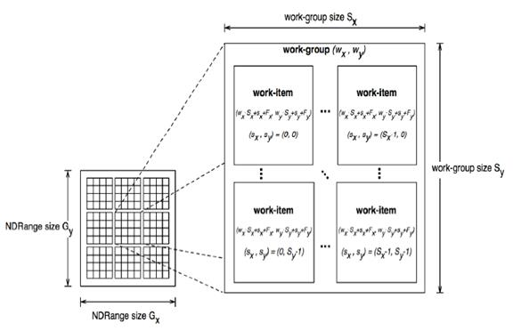

# 3.2 执行模型
OpenCL执行模型是根据两个不同的执行单元定义的：在一个或多个OpenCL设备上执行的内核程序（Kernel）以及在主机上执行的主机程序(host program)。对于OpenCL，Kernel是发生与计算相关的“工作”的地方。这项工作是通过在组（work-group）中执行的工作项(work-item)进行的。

内核在主机管理明确定义的上下文中执行。上下文定义了内核执行的环境。它包括以下资源：
- 设备（Devices）：OpenCL平台开放的一个或多个设备。
- 内核对象(Kernel Object)：OpenCL的功能及其在OpenCL设备上运行的关联参数值。
- 程序对象(Program Object)：实现内核的源程序和可执行文件。
- 内存对象(Memory Object)：主机和OpenCL设备可见的变量。内核实例在这些对象执行时对其进行操作。

主机程序使用OpenCL API创建和管理上下文。 OpenCL API中的功能使主机可以通过命令队列（command-queue）与设备进行交互。每个命令队列都与单个设备关联。放入命令队列的命令属于以下三种类型之一：
- 内核队列命令（Kernel-enqueue commands）：内核入队以在设备上执行。
- 内存命令（memory commands）：在主机和设备内存之间，内存对象之间或从主机地址空间映射和取消映射内存对象之间传输数据。
- 同步命令（Synchronization commands）：显式同步点，用于定义命令之间的顺序约束。

除了从主机命令队列提交的命令之外，在设备上运行的内核还可以将命令排队到设备端命令队列中。这导致子内核被在设备上执行的内核（父内核）排队。无论命令队列是驻留在主机还是设备上，每个命令都会经过六个状态。
- 排队中(Queued)：命令已排队到命令队列中。一个命令可能驻留在队列中，直到被刷新（对clFlush的调用）或被其他命令隐式刷新为止。
- 提交（Submmited）：从命令队列中刷新命令并提交以在设备上执行。一旦从命令队列中刷新之后，命令将在满足所有先决条件之后被执行。
- 准备就绪（Ready）：满足了限制命令执行的所有先决条件。该命令（内核队列命令是与该命令关联的工作组的集合）被放置在设备工作池中，从该设备工作池中要调度执行该命令。
- 运行（Runing）：命令开始执行。对于内核队列命令，与该命令关联的一个或多个工作组开始执行。
- 结束（Ended）：命令的执行结束。当内核队列命令结束时，与该命令关联的所有工作组均已完成其执行。直接的副作用，即与内核相关的副作用，但不一定与其子内核相关的副作用，对于其他执行单元是可见的。这些副作用包括更新全局内存中的值。
- 完成（Complete）：命令及其子命令已完成执行，并且与该命令关联的事件对象（如果有）的状态设置为CL_ COMPLETE。

执行状态和它们之间的转换总结如下。这些状态和设备工作池的概念是执行模型的概念元素。 OpenCL的实现在如何将它们公开给程序方面具有很大的自由度。但是，可以通过性能分析界面直接观察其中的五个转换。这些配置状态如下所示。


图2.状态和在OpenCL执行模型中定义的状态之间的转换。这些过渡的子集通过配置接口公开。

命令通过事件对象传达其状态。将与命令关联的事件状态设置为CL_COMPLETE表示成功完成。完成失败会导致命令异常终止，这可以通过将事件状态设置为负值来表示。在这种情况下，与异常终止的命令关联的命令队列和同一上下文中的所有其他命令队列可能不再可用，并且它们的行为是具体实现定义的。

在解决了限制命令顺序的先决条件之前，提交给设备的命令将不会被启动。这些先决条件有三个来源：
- 它们可能来自提交给命令队列的命令，这些命令限制了命令的启动顺序。例如，遵循命令队列屏障的命令只有在屏障之前的所有命令完成后才能启动。
- 条件的第二个来源是通过事件表达的命令之间的依赖关系。命令可以包括可选的事件列表。该命令将等待，直到列表中的所有事件都处于CL COMPLETE状态后才会启动。通过这种机制，事件对象定义命令之间的顺序约束，并协调主机与一个或多个设备之间的执行。
- 条件的第三个来源可以是存在程序范围全局变量的C初始化或者C++构造器。在这种情况下，OpenCL C/C++编译器应生成执行C初始化或C++构造器的程序初始化内核函数。这些内核必须由设备上的OpenCL运行时执行，然后才能在同一设备上执行来自同一程序的任何内核。所有程序初始化内核的ND-range是（1,1,1）。当多个程序链接在一起时，属于不同程序的程序初始化内核的执行顺序是不确定的。

程序清理可能会导致OpenCL运行时执行一个或多个程序清理内核。这是由于存在用于程序范围变量的C++析构函数。执行任何程序清除内核的ND-range是（1,1,1）。来自不同程序（链接在一起）的清理内核的执行顺序是不确定的。

请注意，程序范围变量的C初始化程序，C++构造函数或C++析构函数不能使用指向粗粒度和细粒度SVM分配的指针。

当在等待并满足事件相关性之外没有可见的副作用时，可以将命令提交给设备。例如包括标记、内核执行在超出没有工作项的范围或者拷贝0大小的拷贝操作时，这样的命令可以直接从就绪状态传递到结束状态。

命令执行可以是阻塞的也可以是非阻塞的。考虑一系列OpenCL命令。对于阻塞命令，在命令完成之前不会返回命令队列的OpenCL API函数。或者，使非阻塞命令排队的OpenCL函数立即返回，并要求程序员定义已排队命令之间的依赖关系，以确保在所需资源可用之前不会启动已排队命令。在这两种情况下，命令的实际执行都可能与主机程序的执行异步发生。

单个命令队列中的命令以两种模式之一相对于彼此执行：
- 顺序执行(In-order Execution)：命令和与命令相关联的任何副作用在OpenCL应用程序中显示，就好像它们以与被排队到命令队列中的相同顺序执行一样。
- 乱序执行(Out-of-order Execution)：命令以任何顺序执行，仅受显式同步点（例如通过命令队列屏障）或对事件的显式依赖项约束。

单个上下文中可以存在多个命令队列。多个命令队列可独立执行命令。主机程序可见的事件对象可用于定义多个命令队列中命令之间的同步点。如果在多个命令队列中的命令之间建立了这样的同步点，则实现方式必须确保命令队列并发进行，并正确说明由同步点建立的依赖性。有关同步点的详细说明，请参见执行模型：同步。

OpenCL执行模型的核心由内核执行方式定义。当kernel-enqueue命令提交要执行的内核时，将定义索引空间。`内核`，`与内核参数关联的参数值`以及`定义索引空间的参数`定义了内核实例（kernel-instance）。当内核实例在设备上执行时，内核函数在索引空间中定义的每个点上执行。这些执行内核功能的每一个点都称为工作项（work-item）。与给定内核实例关联的工作项由设备按称为工作组（work-group）的组进行管理。这些工作组定义了索引空间的粗粒度分解。工作组进一步分为子组，这些子组提供了对执行的附加控制级别。

工作项具有基于其在索引空间内的坐标的全局ID（Global-ID）。还可以根据工作组和工作组中的本地ID来定义它们。下一部分将描述此映射的详细信息。

## 3.2.1 执行模型：将工作项映射到NDRange
OpenCL支持的索引空间称为NDRange。 NDRange是N维索引空间，其中N是一，二或三。 NDRange被分解为工作组，形成覆盖索引空间的块。 NDRange由长度为N的三个整数数组定义：
- 每个维度中索引空间的范围（或全局大小）。
- 偏移索引F表示每个维度中索引的初始值（默认为零）。
- 每个维度中工作组的大小（本地大小）。

每个工作项全局ID是一个N维元组。全局ID组件的值在F到F加上该维度中的元素数减一的范围内。

如果从OpenCL 2.0或SPIR-V创建内核，则NDRange中工作组的大小（本地大小）不必对所有工作组都相同。在这种情况下，全局大小不能被局部大小整除的任何单个尺寸都将被分为两个区域。一个区域将具有工作组，其工作项目的数量与程序员为此维度指定的数量相同（本地大小）。另一个区域的工作组少于该维度中本地大小参数指定的工作项目数（其余工作组）。工作组大小在多个维度上可能不一致，从而可能在2D范围内产生多达4个不同大小的工作组，而在3D范围内产生多达8个不同大小的工作组。

每个工作项目都分配给一个工作组，并获得一个本地ID，以表示其在工作组中的位置。工作项目的本地ID是一个N维元组，其组成部分的范围是从零到该维度中工作组的大小减去一。

为工作组分配相似的ID。每个维度中的工作组数量不是直接定义的，而是从将内核实例加入队列时提供的本地和全局NDRanges推断出来的。工作组的ID是一个N维元组，其成分的范围是该维中全局尺寸的上限到0的范围，再除以同一维中的局部尺寸。结果，工作组ID和工作组中的本地ID的组合唯一定义了一个工作项。每个工作项目都可以通过两种方式进行标识：就全局索引而言，就工作组索引而言，再加上工作组中的本地索引而言。

例如，考虑如下所示的二维索引空间。我们输入工作项的索引空间（Gx，Gy），每个工作组的大小（Sx，Sy）和全局ID偏移量（Fx，Fy）。全局索引定义一个Gxby Gy索引空间，其中工作项的总数是Gx和Gy的乘积。局部索引定义了一个Sx by Sy索引空间，其中单个工作组中的工作项数是Sx和Sy的乘积。给定每个工作组的大小和工作项目的总数，我们可以计算工作组的数量。二维索引空间用于唯一地标识工作组。每个工作项都通过其全局ID（gx，gy）或工作组ID（wx，wy），每个工作组的大小（Sx，Sy）和本地ID（sx， sy）在工作组内

    (gx , gy) = (wx Sx + sx + Fx, wy Sy + sy + Fy)  
工作组的数量可以计算为：  
    (Wx, Wy) = (ceil(Gx / Sx), ceil(Gy / Sy))  
给定一个全局ID和工作组大小，一个工作项目的工作组ID计算为：  
    (wx, wy) = ( (gx sx Fx) / Sx, (gy sy Fy) / Sy )


图3. NDRange索引空间的示例，其中显示了工作项，它们的全局ID以及它们到工作组ID和本地ID对的映射。在这种情况下，我们假设在每个维度中，工作组的大小均匀地划分了全局NDRange大小（即所有工作组的大小相同），并且偏移量等于零。

在工作组中，工作项可以分为多个子组。工作项到子组的映射是实现定义的，可以在运行时查询。尽管可以在多维工作组中使用子组，但是每个子组都是一维的，任何给定的工作项目都可以查询它是哪个子组的成员。

通过编译时决策和调度参数的组合，工作项被映射到子组中。在具有相同工作组维的给定内核的分派之间，在与分派参数化一致的分派和查询操作之间以及从一个工作组到另一个工作组之间，到子组的映射在内核执行期间是不变的分派（不包括工作组大小不一致的后端工作组）。此外，工作组中的所有子组都将具有相同的大小，除了具有最大索引的子组之外，如果工作组的大小不能均匀地被子组的大小整除，则最大索引可能会更小组。

在简并的情况下，每个工作组必须支持一个子组。在这种情况下，所有子组作用域功能都等同于其工作组级别的功能。

## 3.2.2 执行模型：内核实例的执行
OpenCL程序执行的工作是通过在计算设备上执行内核实例来完成的。要了解OpenCL执行模型的详细信息，我们需要考虑内核对象如何从kernel-enqueue命令移入命令队列，并在设备上执行并完成。

内核对象是通过程序对象中的函数以及将内核连接到一组参数值的参数集合定义的。主机程序将内核对象以及NDRange和工作组分解排队到命令队列中。这些定义了内核实例。另外，当内核入队时，可以定义一组可选的事件。当队列实例中的其他命令或同一上下文中其他队列中的命令被启动时，与特定内核实例关联的事件用于约束何时启动内核实例。

内核实例已提交给设备。对于顺序命令队列，内核实例似乎以相同的顺序启动并执行；我们在这里使用的术语似乎强调指出，当命令之间没有依赖关系，因此在程序中无法观察到命令执行顺序的差异时，即使在顺序排列的命令队列中，实现也可以对命令重新排序。对于混乱的命令队列，内核实例将等待启动，直到：

- 满足内核实例之前排队的同步命令。
- 将内核实例入队时定义的可选事件列表中的每个事件均设置为CL_COMPLETE。

满足这些条件后，将启动内核实例，并将与内核实例关联的工作组放入准备好执行工作组的池中。该池称为工作池。只要可以确保放置在池中的工作组最终执行，就可以以任何方式实现工作池。设备从工作池调度工作组，以在设备的计算单元上执行。当所有与内核实例相关联的工作组结束执行，对与命令相关联的全局内存的更新在全局范围内可见，并且设备通过设置与内核队列相关联的事件来信号通知成功完成时，kernel-enqueue命令完成。命令以CL_完成。

虽然命令队列仅与一个设备相关联，但是单个设备可能与多个都馈入单个工作池的多个命令队列相关联。设备也可以与同一平台内与不同上下文相关联的命令队列相关联，所有命令队列都再次馈入单个工作池。该设备将从工作池中提取工作组，并以任何顺序在一个或几个计算单元上执行它们。可能会从多个命令中交错执行工作组。符合标准的实现可能选择序列化工作组，因此正确的算法不能假定工作组将并行执行。在工作组的独立执行之间没有安全且可移植的方式进行同步，因为一旦进入工作池，它们就可以以任何顺序执行。

单个子组中的工作项目可以同时执行，但不一定要并行执行（即，不能保证它们有独立的前进进度）。因此，只有适用于子组中所有工作项的高级同步结构（例如，诸如屏障等子组功能）才能得到很好的定义并包含在OpenCL中。

子组可以在给定的工作组内并在适当的设备支持下同时执行（请参阅查询设备），可以相对于彼此，相对于主机线程以及相对于OpenCL系统外部的任何实体独立地进行转发。即使没有工作组屏障操作，也可以在OpenCL设备上运行。在这种情况下，子组能够使用屏障操作在内部进行同步而无需彼此同步，并且可以执行依赖于其他子组执行的操作的运行时依赖性的操作。

单个工作组中的工作项可以同时执行，但只有在存在子组和设备支持的情况下，才能保证取得独立的进展。在没有此功能的情况下，只有适用于工作组中所有工作项的高级同步结构（例如，屏障等工作组功能）才能得到很好的定义，并包含在OpenCL中以在工作组内进行同步。

在没有同步功能（例如，障碍）的情况下，子组内的工作项目可以被序列化。在存在子组功能的情况下，可以在动态遇到的子组功能对之间以及工作组功能与内核末尾之间的任何给定子组功能之前，将子组内的工作项序列化。 。

如果组成子组没有独立的前进进度，则可以在工作组同步功能之前，之后或之间对工作组内的工作项目进行序列化。

## 3.2.3 执行模型：设备端入队
算法执行时可能需要生成其他工作。在许多情况下，无法静态确定这项额外的工作；因此，与内核相关的工作仅在内核实例执行时才在运行时出现。可以在主机程序内运行的逻辑中实现此功能，但是主机的参与可能会增加应用程序控制流程的开销和/或复杂性。一种更有效的方法是从其他内核内部嵌套内核入队命令。这种嵌套并行性可以通过在设备上支持内核排队而无需主机程序直接参与来实现。所谓的设备端入队。

设备端内核入队命令类似于主机端内核入队命令。在设备上执行的内核（父内核）将内核实例（子内核）排队到设备端命令队列中。这是乱序命令队列，并且行为与暴露给主机程序的乱序命令队列相同。排队到设备端命令队列的命令将生成并使用事件来强制执行顺序约束，就像主机上的命令队列一样。但是，这些事件仅对设备上运行的父内核可见。当这些前提事件的值为CL_COMPLETE时，与子内核关联的工作组将启动到设备工作池中。然后，设备安排它们以在设备的计算单元上执行。子内核和父内核异步执行。但是，在所有子内核都结束执行并通过将任何关联事件设置为值CL_ COMPLETE来表示完成之前，父级不会通过将其事件设置为CL_COMPLETE来表示已完成。如果任何子内核完成并将事件状态设置为负值（即异常终止），则父内核将异常终止并传播子负事件值作为父事件的值。如果有多个子项的事件状态设置为负值，则传播定义为哪个子项负事件值的选择是实现定义的。

## 3.2.4 执行模型：同步
同步是指在两个或多个执行单元之间限制执行顺序的机制。请考虑以下三个OpenCL同步域：
- 工作组同步：限制单个工作组中工作项的执行顺序
- 子组同步：限制单个子组中工作项的执行顺序
- 命令同步：限制为执行而启动的命令的顺序

使用工作组功能在单个工作组中的所有工作项之间进行同步。这些功能在工作组中的所有工作项上执行集体操作。可用的集体运算有：屏障，归约，广播，前缀和和谓词评估。工作组功能必须在聚合控制流中发生；也就是说，工作组中的所有工作项都必须遇到完全相同的工作组功能。例如，如果工作组功能发生在循环内，则工作项必须在相同的循环迭代中遇到相同的工作组功能。工作组的所有工作项必须执行工作组功能并完成对内存的读写，然后再允许任何内容继续执行超出工作组功能的执行。由于OpenCL并未定义工作组之间的前向或顺序关系，因此OpenCL中未提供适用于工作组之间的工作组功能。因此，没有很好地定义集体同步操作。

单个子组中所有工作项之间的同步是使用子组功能执行的。这些功能对子组中的所有工作项执行集体操作。可用的集体运算有：屏障，归约，广播，前缀和和谓词评估。子功能必须在融合控制流中发生；也就是说，子组中的所有工作项都必须遇到完全相同的子组功能。例如，如果工作组功能发生在循环内，则工作项必须在相同的循环迭代中遇到相同的子组功能。子组的所有工作项必须执行子组功能并完成对内存的读取和写入，然后再允许任何内容继续执行该子组功能以外的内容。子组之间的同步必须使用工作组功能或通过内存操作来执行。应谨慎使用将内存操作用于子组同步，因为OpenCL实现仅可选地支持子组相对于彼此的前进进度。

命令同步是根据不同的同步点定义的。同步点出现在主机命令队列中的命令之间以及设备侧命令队列中的命令之间。 OpenCL中定义的同步点包括：
- 启动命令：将内核正在等待的所有事件都设置为CL_ COMPLETE之后，内核实例将被启动到设备上。
- 结束命令：子内核可能会排队，以便它们在启动之前等待父内核到达结束状态。在这种情况下，父命令的结尾定义一个同步点。
- 命令完成：在内核中的所有工作组及其所有子内核都完成之后，内核实例完成。通过将与内核关联的事件的值设置为CL_COMPLETE，将其发送给命令队列中的主机，父内核或其他内核。
- 阻塞命令：阻塞命令定义了调用阻塞API函数的执行单元与到达完成状态的入队命令之间的同步点。
- 命令队列屏障：命令队列屏障可确保所有先前排队的命令都已完成，然后才能启动随后排队的命令。
- clFinish：此函数将阻塞，直到命令队列中所有先前排队的命令都已完成，之后clFinish定义了一个同步点，然后clFinish函数返回。

一对命令（A和B）之间的同步点可确保在启动命令B之前发生命令A的结果。这要求在同步点完成之前，必须完成命令A中对内存的所有更新，并使其可用于其他命令。同样，这要求命令B等到同步点之后，再从全局存储器加载值。同步点的概念以类似的方式用于适用于两组命令的命令（例如屏障）。屏障之前的所有命令必须完成，并使它们的结果可用于以下命令。此外，屏障后面的任何命令都必须在屏障之前等待命令，然后再加载值并继续执行它们。

这些先发生后关系是OpenCL内存模型的基本部分。当在命令级别应用时，它们很容易根据不同命令之间的顺序关系在语言级别进行定义。但是，在不同命令中对内存操作进行排序需要的规则比同步点的高级概念所能捕获的规则更为复杂。这些规则在“内存排序规则”中有详细描述。

##3.2.5 执行模型：内核类别
OpenCL执行模型支持三种类型的内核：
- OpenCL kernels: OpenCL内核由OpenCL API作为与程序对象中的内核功能关联的内核对象进行管理。 OpenCL内核是通过内核语言提供的。所有OpenCL实现都必须支持以标准SPIR-V中间语言提供的带有适当环境规范的OpenCL内核，以及在OpenCL规范的早期版本中定义的OpenCL C编程语言。实现还必须支持SPIR-V中间语言的OpenCL内核。 SPIR-V二进制文件不能由OpenCL内核语言生成，也可以由第三方编译器从替代输入中生成。
- Native kernels: 通过主机函数指针访问本机内核。本地内核与设备上的OpenCL内核一起排队等待执行，并与OpenCL内核共享内存对象。例如，这些本机内核可以是在应用程序代码中定义的功能，也可以是从库中导出的功能。在OpenCL中，执行本机内核的能力是可选的，并且本机内核的语义是实现定义的。 OpenCL API包括查询设备功能并确定是否支持此功能的功能。
- Built-in kernels: 内置内核绑定到特定设备，并且不是在运行时根据程序对象中的源代码构建的。内置内核的常见用途是公开与特定OpenCL设备或自定义设备关联的固定功能的硬件或固件。内置内核的语义可以在OpenCL之外定义，因此可以定义为实现。

所有这三种类型的内核都通过OpenCL命令队列进行操作，并且必须符合OpenCL执行模型中定义的同步点。

## 内存模型
OpenCL内存模型描述了OpenCL程序运行时OpenCL平台公开的内存的结构，内容和行为。该模型允许程序员在主机程序和多个内核实例执行时推断内存中的值。

OpenCL程序定义了一个上下文，该上下文包括主机，一个或多个设备，命令队列以及在上下文中公开的内存。考虑这种程序涉及的执行单位。主机程序作为一个或多个主机线程运行，该线程由主机上运行的操作系统管理（其详细信息在OpenCL之外定义）。在单个上下文中可能有多个设备，所有设备都可以访问OpenCL定义的内存对象。在单个设备上，多个工作组可以与可能重叠的内存更新并行执行。最后，在单个工作组中，多个工作项同时执行，并且可能对内存进行重叠更新。

内存模型必须精确定义从这些执行单元中的每一个看到的内存中的值如何交互，以便程序员可以推断OpenCL程序的正确性。我们分为四个部分来定义内存模型。

- 内存区域：主机和共享上下文的设备可以看到的独特内存。
- 内存对象：由OpenCL API定义的对象，以及由主机和设备进行管理的对象。
- 共享虚拟内存：在上下文中公开给主机和设备的虚拟地址空间。
- 一致性模型：定义多个执行单元从内存中加载数据以及约束内存操作顺序并定义同步关系的原子/栅栏操作时，将观察到哪些值的规则。

## 内存模型：基本内存区域
OpenCL中的内存分为两部分。
- 主机内存：主机直接可用的内存。主机内存的详细行为在OpenCL之外定义。内存对象通过OpenCL API中的功能或共享的虚拟内存接口在主机和设备之间移动。
- 设备内存：内存可直接用于在OpenCL设备上执行的内核。

设备内存由四个命名的地址空间或内存区域组成：
- 全局内存：此内存区域允许对在上下文内任何设备上运行的所有工作组中的所有工作项进行读/写访问。工作项可以读取或写入内存对象的任何元素。根据设备的功能，可能会缓存对全局内存的读取和写入。
- 常量内存：在内核实例执行期间保持不变的全局内存区域。主机分配并初始化放置在恒定内存中的内存对象。
- 本地内存：工作组本地的内存区域。该内存区域可用于分配该工作组中所有工作项共享的变量。
- 私有内存：工作项专用的内存区域。在一个工作项专用存储器中定义的变量对另一个工作项不可见。

内存区域及其与OpenCL平台模型的关系概述如下。本地和私有存储器始终与特定设备相关联。但是，全局和常量存储器在给定上下文中在所有设备之间共享。 OpenCL设备可能包括缓存，以支持对这些共享内存的有效访问。

要了解OpenCL中的内存，重要的是要了解这些命名地址空间之间的关系。设备可用的四个命名地址空间是不相交的，这意味着它们不会重叠。但是，这是一种逻辑关系，实现可以选择让这些不相交的命名地址空间共享物理内存。

程序员通常需要可从内核调用的函数，其中由这些函数操纵的指针可以指向多个命名的地址空间。这使程序员免于创建函数的多个副本的容易出错和浪费的实践。每个命名的地址空间一个。因此，全局，本地和专用地址空间属于单个通用地址空间。这是在嵌入式C标准（ISO / IEC 9899：1999）中使用的通用地址空间的概念之后进行紧密建模的。由于它们都属于单个通用地址空间，因此支持以下属性来指向设备内存中已命名地址空间的指针：
- 指向通用地址空间的指针可以转换为指向全局，本地或私有地址空间的指针
- 指向全局，本地或私有地址空间的指针可以转换为指向通用地址空间的指针。
- 指向全局，本地或私有地址空间的指针可以隐式转换为指向通用地址空间的指针，但不允许相反。

常量地址空间与通用地址空间不相交。
与全局内存中的内存对象关联的内存地址未在内核实例之间，设备与主机之间以及设备之间保留。在这方面，全局存储器充当存储器对象的全局池，而不是地址空间。使用共享虚拟内存（SVM）时，可以放宽此限制。

SVM导致主机和上下文中所有设备之间的地址有意义，因此支持在OpenCL内核中使用基于指针的数据结构。它在逻辑上将全局内存的一部分扩展到主机地址空间中，从而使工作项可以访问主机地址空间。在具有对主机和一个或多个设备之间的共享地址空间的硬件支持的平台上，SVM还可以提供一种更有效的方式来在设备和主机之间共享数据。有关SVM的详细信息，请参见共享虚拟内存。

  
图4. OpenCL平台中公开的命名地址空间。全局和常量内存在上下文中的一个或多个设备之间共享，而本地和私有内存与单个设备相关联。每个设备可以包括一个可选的高速缓存，以支持对其全局和恒定地址空间视图的有效访问。

程序员可以使用内存一致性模型的功能来管理可能在一个或多个设备上运行的多个工作项对全局内存的安全访问。另外，在使用共享虚拟内存（SVM）时，内存一致性模型也可以用于确保主机线程安全地访问共享内存区域中的内存位置。

## 3.3.2 内存模型：内存对象
全局内存的内容是内存对象。内存对象是全局内存的引用计数区域的句柄。内存对象使用OpenCL类型cl_mem并分为三个不同的类。
- 缓冲区：存储为连续内存块的内存对象，用作通用对象来保存OpenCL程序中使用的数据。缓冲区内的值的类型可以是任何内置类型（例如int，float），向量类型或用户定义的结构。可以通过指针操纵缓冲区，就像使用C中的任何内存块一样。
- 图像：图像存储对象保存一维，二维或三维图像。这些格式基于图形应用程序中使用的标准图像格式。图像是由OpenCL API中定义的函数管理的不透明数据结构。为了优化存储在许多GPU中的纹理存储器中存储的图像的操作，传统上不允许OpenCL内核读取和写入单个图像。但是，在OpenCL 2.0中，我们通过提供同步和隔离操作放松了这一限制，使程序员可以正确地同步其代码以安全地允许内核读取和写入单个映像。
- 管道：管道存储对象从概念上讲是数据项的有序序列。管道具有两个端点：一个插入端点，数据项插入到该端点；一个读取端点，数据项从中删除。在任何时候，只有一个内核实例可以写入管道，并且只有一个内核实例可以从管道读取。为了支持生产者使用者设计模式，一个内核实例连接到写入端点（生产者），而另一个内核实例连接到读取端点（使用者）。

内存对象由主机API分配。主机程序可以为运行时提供指向连续内存块的指针，以在创建对象时保存内存对象（CL_MEM_USE_HOST_PTR）。或者，物理内存可以由OpenCL运行时管理，并且不能直接由主机程序访问。

在设备上运行的主机和工作项之间，对不同内存区域内的内存对象的分配和访问有所不同。这在“内存区域”表中进行了汇总，该表描述了内核还是主机可以从内存区域进行分配，分配的类型（编译时为静态，而运行时为动态）以及允许的访问类型（即，内核是否或主机可以读取和/或写入存储区域）。

表1.内存区域:
| 区域 | 全局 | 常量 | 本地 | 私有 |
|-|-|-|-|-|
| Host | 动态分配 | 动态分配 | 动态分配 | 不分配 |
| Host | 读/写（对缓冲区和图像的访问，但不对管道的访问） | 
| kernel | 程序范围变量的静态分配 | 静态分配 | 静态分配。 子内核动态分配 | 静态分配 |
| kernel | 读/写访问 | 只读访问 | 读/写访问。 无法访问孩子的本地存储。 | 读/写访问 |
```
说明
内存区域表显示了OpenCL中的不同内存区域，以及主机和内核的执行实例如何分配和访问内存对象。对于内核，我们区分本地存储器相对于内核（自身）及其子内核的行为。
```

一旦分配，就可以使一个内存对象可用于一个或多个设备上运行的内核实例。除了共享虚拟内存，还有三种基本方法可以管理主机和设备之间的缓冲区内容。
- 读/写/填充命令：使用排队到OpenCL命令队列的命令在主机和全局内存区域之间显式读取和写入与内存对象关联的数据。
- 映射/取消映射命令：来自内存对象的数据被映射到通过主机可访问指针访问的连续内存块中。在宿主程序可以安全地对其进行操纵之前，宿主程序先将映射命令加入到存储对象块中。当主机程序完成对内存块的处理后，主机程序将使用unmap命令，以允许内核实例安全地读取和/或写入缓冲区。
- 复制命令：与内存对象关联的数据在两个缓冲区之间复制，每个缓冲区可以驻留在主机上或设备上。

使用读/写/映射，命令可以是阻塞操作或非阻塞操作。命令（内存传输）完成后，将返回用于阻止内存传输的OpenCL函数调用。此时，可以安全地重用主机上关联的内存资源，并确保主机上的后续操作已完成传输。对于无阻塞的内存传输，命令入队后，OpenCL函数调用将立即返回。

内存对象绑定到上下文，因此可以出现在多个物理设备上运行的多个内核实例中。 OpenCL平台必须支持广泛的硬件平台，包括不支持硬件中单个共享地址空间的系统。因此限制了内核实例之间共享内存对象的方式。基本原理是，允许在时间上重叠的多个内核实例对内存对象进行多次读取操作，但是仅当与Shared Virtual一起使用细粒度的同步时，才允许将重叠的读写操作从不同的内核实例混合到同一内存对象记忆。

当全局内存由在多个设备上运行的多个内核实例操纵时，OpenCL运行时系统必须管理内存对象与给定设备的关联。在大多数情况下，OpenCL运行时会将内存对象与设备隐式关联。内核实例自然与提交内核的命令队列相关联。由于命令队列只能访问单个设备，因此队列唯一地定义了任何给定的内核实例涉及哪个设备。因此在内存对象，内核实例和设备之间定义了明确的关联。程序员可以在他们的程序中预期这些关联，并显式管理内存对象与设备的关联以提高性能。

## 3.3.3。内存模型：共享虚拟内存
OpenCL通过共享虚拟内存（SVM）机制将全局内存区域扩展到主机内存区域。 OpenCL中有三种类型的SVM
- 粗粒度缓冲区SVM：共享发生在OpenCL缓冲区内存对象区域的粒度上。在同步点和使用map / unmap命令强制一致性，以驱动主机和设备之间的更新。这种SVM形式类似于非SVM的内存使用方式。但是，它允许内核实例与主机程序共享基于指针的数据结构（例如，链表）。程序范围的全局变量被视为按设备的粗粒度SVM，以进行寻址和共享。
- 细粒度的缓冲区SVM：共享发生在OpenCL缓冲区内存对象内单个加载/存储到字节的粒度上。加载和存储可能会被缓存。这意味着可以确保同步点的一致性。如果支持可选的OpenCL原子，则可以使用它们来提供对内存一致性的细粒度控制。
- 精细的系统SVM：共享发生在单个加载/存储的粒度上，发生在主机内存中任何位置的字节中。可以缓存加载和存储，因此可以确保同步点的一致性。如果支持可选的OpenCL原子，则可以使用它们来提供对内存一致性的细粒度控制。

表2. OpenCL中的共享虚拟内存（SVM）选项摘要
| SVM | 共享的粒度 | 内存分配 | 实施一致性的机制 | 主机与设备之间的显式更新 |
|-|-|-|-|-|
| 非SVM缓冲区 | OpenCL内存对象（缓冲区） | clCreateBuffer | 主机同步点位于同一设备上或设备之间。 | 是的，通过Map和Unmap命令。 |
| 粗粒度缓冲区SVM | OpenCL内存对象（缓冲区） | clSVMAlloc | 设备之间的主机同步点 | 是的，通过Map和Unmap命令。 |
| 细粒度的缓冲区SVM | OpenCL内存对象（缓冲区）中的字节 | clSVMAlloc | 同步点加原子（如果支持） | No |
| 细粒度系统SVM | 主机内存（系统）中的字节 | 主机内存分配机制（例如malloc） | 同步点加原子（如果支持） | No |

核心OpenCL规范中需要粗粒度缓冲区SVM。两种更精细的方法是OpenCL中的可选功能。上面总结了从与内核实例相关的工作项访问主机内存的各种SVM机制。

## 3.3.4 内存模型：内存一致性模型
OpenCL内存模型告诉程序员他们对OpenCL实现的期望。保证哪些内存操作以什么顺序发生以及每个读取操作将返回哪些内存值。内存模型告诉编译器编写者在实现编译器优化时必须遵循哪些限制；它们可以将哪些变量缓存在寄存器中，以及何时可以围绕屏障或原子操作移动读取或写入。内存模型还告诉硬件设计人员有关硬件优化的限制。例如，当它们必须刷新或使硬件缓存无效时。

OpenCL中的内存一致性模型基于ISO C11编程语言中的内存模型。为了使演示文稿更精确，更完整，我们引用了ISO C11国际标准中的所有修改段落。从C11标准中选取或修改段落时，该段落及其在C11标准中的原始位置也将被标识。

对程序员来说,最直观的模型 顺序一致性 内存模型。 顺序一致性上面的步骤执行的每个单元 的执行。 每个访问内存位置看到的最后一个任务的位置 交叉。 同时为一个程序员顺序一致性是相对简单的 原因,实现顺序一致性是昂贵的。 因此,OpenCL实现轻松内存一致性模型; 即它是 可以编写程序,从内存加载违反顺序 一致性。 幸运的是,如果一个程序不包含任何种族和如果程序 使用原子操作,利用顺序记忆顺序一致 (OpenCL的默认内存排序),OpenCL程序执行 与顺序一致性。

程序员可以在一定程度上控制内存模型是如何放松 选择记忆订单同步操作。 同步和内存的精确语义正式订单 中定义的 内存排序规则 . 在这里,我们提供一个高水平的描述如何将这些记忆订单申请 原子的原子操作对象之间共享单位执行。 OpenCL memory_order选择是基于ISO C11标准 内存模型。 他们在某些指定OpenCL通过以下功能 枚举常量:
- memory_order_relaxed :意味着没有约束。 这个内存顺序可以安全地用于增量反驳说 同时增加,但doesna€™t的保证 要求对操作其他的内存位置。 它也可以被使用,例如,分配和由专家做票 程序员实现无锁定算法。
- memory_order_acquire :一个同步操作(栅栏或原子) 已获得语义“获得”的副作用 与它同步操作:如果一个获得同步的 版本,执行会看到所有的收购单位的副作用 前释放(可能还有后续副作用。) 作为 精心设计的协议,程序员可以使用一个“收购” 安全观察执行另一个单位的工作。
- memory_order_release :一个同步操作(栅栏或原子 操作),释放语义“释放”副作用 获得同步操作。 所有副作用包括之前释放。 精心设计的协议的一部分,程序员可以使用一个“发布” 改变一个单位的制造执行可见到其他单位 执行。

```
一般来说,没有获得必须的 总是 与任何特定的同步 释放。 然而,同步可以通过某些强制执行。 看到 记忆顺序规则:栅栏操作 为 详细规则当同步必须发生。 
```

- memory_order_acq_rel :与acquire-release同步操作 语义属性的获取和释放内存 订单。 它通常用于顺序读-修改-写操作。
- memory_order_seq_cst :每个单元的加载和存储执行 似乎在程序(即执行。 测序)秩序,和 加载和存储来自不同单位的执行似乎简单 交叉。  
无论指定memory_order,解决限制 内存操作跨异构平台增加相当大的开销 程序执行的。 OpenCL平台可以优化取决于特定的操作 内存一致性模型的功能限制的范围 内存操作。 不同的内存范围由memory_scope的值定义的 枚举常量:
- memory_scope_work_item :只有在内存排序约束 的工作项 1 .

```
    1:这个值与atomic_work_item_fence memory_scope只能用 将CLK_IMAGE_MEM_FENCE国旗。
```

- memory_scope_sub_group :只有在内存排序约束 子群。
- memory_scope_work_group 只适用于:内存排序约束 工作项执行在一个“workgroup”。
- memory_scope_device: 只适用于内存排序约束 工作项执行在一个设备上
- memory_scope_all_svm_devices 内存排序约束适用于跨多个设备和主机（在使用SVM时）执行的工作项。使用memory_scope_all_svm_devices对没有CL_​MEM_​SVM_​ATOMICS设置标志的缓冲区执行的释放将至少实现 

这些内存范围定义的层次结构分析时可见性 排序操作的内存限制。 例如,如果一个程序员知道内存操作的序列 只是从一个“workgroup”相关的工作项的集合 (因此将运行在单个设备),实现的 管理内存的开销在其他设备在同一个订单 上下文。 这可以大大减少程序的开销。 所有内存范围使用时是有效的全局内存或本地内存。 对于本地内存,所有的可见性是在一个给定的“workgroup”约束 和范围更广泛的比 memory_scope_work_group 没有额外的意义。

下面(之前 OpenCL 框架 ),我们将解释同步结构和详细 规则需要使用OpenCLa€™年代轻松记忆模型。 感激是很重要的,然而,许多项目不受益 从轻松的记忆模型。 甚至专家程序员很难利用原子和栅栏 编写正确的程序与轻松记忆模型。 可以编写大量OpenCL的程序使用一个简化的内存 模型。 这是遵循这些指导方针。
- 编写程序,管理安全的共享全局内存对象 定义的同步点命令队列。
- 限制低水平同步内部工作组“workgroup” 等功能障碍。
- 如果你想要顺序一致性和系统配置或行为 精密SVM与原子缓冲区支持,只使用 memory_order_seq_cst 操作的范围 memory_scope_all_svm_devices .
- 如果你想要当不使用系统顺序一致性的行为 分配或精密SVM缓冲区在原子的支持下,只使用 memory_order_seq_cst 操作的范围 memory_scope_device 或 memory_scope_all_svm_devices .
- 确保你的程序没有比赛。

如果遵循这些指导方针OpenCL的项目,你可以跳过 详细规则背后的轻松的内存模型和直接 OpenCL框架 .

## 3.3.5。 内存模型:原子和栅栏操作的概述

3.3.5。内存模型：原子和篱笆操作概述

OpenCL 2.0规范定义了许多同步操作，这些操作用于定义程序中的内存顺序约束。它们在控制如何使一个执行单元中的内存操作（例如工作项或使用SVM的主机线程）对另一执行单元可见时发挥特殊作用。OpenCL中有两种类型的同步操作：原子操作和围栏。

原子操作是不可分割的。它们要么完全发生，要么根本不发生。这些操作用于对执行单元之间的内存操作进行排序，因此它们使用由OpenCL内存一致性模型定义的memory_order和memory_scope参数进行参数化。OpenCL内核语言的原子操作类似于C11标准定义的相应操作。

OpenCL 2.0原子操作适用于原子类型（C11标准中的子集）的变量，包括int，uint，long，ulong，float，double，half，intptr_t，uintptr_t，size_t和ptrdiff_t类型的原子版本。但是，对其中一些原子类型的支持取决于对相应常规类型的支持。

一个或多个存储位置上的原子操作要么是获取操作，释放操作，要么是获取和释放操作。没有关联存储位置的原子操作是围栏，可以是获取围栏，发布围栏，或者是获取围栏和发布围栏。此外，还有不具有同步属性的宽松原子操作和具有特殊特征的原子读取-修改-写入操作。 [C11标准，第5.1.2.4节，第5段，已修改。]

The orders memory_order_acquire (used for reads), memory_order_release (used for writes), and memory_order_acq_rel（用于读-修改-写操作）用于使用共享变量在执行单元之间进行简单通信。非正式地，在原子对象A上执行memory_order_release使所有先前的副作用对于以后在A上执行memory_order_acquire的任何执行单元可见。order memory_order_acquire，memory_order_release和 memory_order_acq_rel不会为无竞争程序提供顺序一致性，因为它们会不能确保其他线程按此顺序看到原子存储和原子负载。

隔离操作是atomic_work_item_fence，它包括一个memory_order参数以及memory_scope和cl_mem_fence_flags参数。根据memory_order参数，此操作：
- 果memory_order_relaxed没有影响；
- 如果memory_order_acquire是获取栅栏；
- 如果为memory_order_release，则为释放栅栏；
- 如果memory_order_acq_rel，则既是获取隔离区，也是释放隔离区；
- 如果具有memory_order_seq_cst，则是具有获取和释放语义的顺序一致的篱笆。

如果指定，cl_mem_fence_flags参数必须为CLK_IMAGE_MEM_FENCE，CLK_GLOBAL_MEM_FENCE，CLK_LOCAL_MEM_FENCE或CLK_GLOBAL_MEM_FENCE |。CLK_LOCAL_MEM_FENCE。

必须使用atomic_work_item_fence（CLK_IMAGE_MEM_FENCE）内置函数来确保无采样器的写入对于同一工作项以后的读取可见。如果不使用atomic_work_item_fence函数，就不能保证图像对象的读写一致性：如果工作项从之前已写入的图像中读取而没有中间的atomic_work_item_fence，则不能保证先前的写入对对象可见。工作项目。

OpenCL中的同步操作可以由memory_scope参数化。内存范围控制相对于内存模型可见的原子操作或篱笆的范围。在全局内存和本地内存上执行原子操作和防护时，可以使用这些内存作用域。在全局内存上使用时，可见性受该内存的功能限制。当在细粒度的非原子SVM缓冲区，粗粒度SVM缓冲区或非SVM缓冲区上使用时，使用memory_scope_all_svm_devices参数化的操作的 行为就好像是使用memory_scope_device参数化的操作一样。当在本地内存上使用时，可见性受工作组的限制，因此，具有比memory_scope_work_group更大的可见性的memory_scope 将减少到memory_scope_work_group。

如果两个动作A和B具有相同的范围P，则它们被定义为包含一个范围，使得：
- 是memory_scope_sub_group，而A和B由同一子组中的工作项执行。
- P是memory_scope_work_group，A和B由同一工作组内的工作项执行。
- P是memory_scope_device和一个和乙是由同一个设备上工作项目时执行一个和乙应用到SVM分配或一个 和乙是由工作内容要在同一内核中执行，或者当它的一个子一个和乙申请到cl_mem缓冲区。
- 如果A和B由主机线程或一个或多个可以彼此共享SVM内存和主机进程的设备上的工作项执行，则P为memory_scope_all_svm_devices。

3.3.6。内存模型：内存排序规则

从根本上讲，内存模型中的问题是要了解对内存中对象进行修改的时间顺序。修改对象或调用修改对象的函数是副作用，即执行环境状态的更改。对表达式的评估通常包括值计算和副作用的启动。左值表达式的值计算包括确定指定对象的身份。 [C11标准，第5.1.2.3节，第2段，已修改。]

我们假定OpenCL内核语言和主机编程语言在单个执行单元执行的评估之间具有先后顺序关系。这种先验顺序关系是这些评估之间的不对称，可传递，成对关系，从而在评估之间引起部分排序。给定任意两个评价一个和乙，如果一个被测序-之前乙，然后执行一个应先执行乙。（相反，如果A在B之前排序，则B在A之后排序 。）如果A在B之前不排序或在之后B，则A和 B是无序列的。当A在B之前或之后进行排序时，评估A和B的顺序不确定，但不确定。 [C11标准，第5.1.2.3节，第3段，已修改。]
```
	先于顺序是单个执行单元（例如，主机线程或工作项）执行的操作的部分顺序。它通常与那些操作的源程序顺序相对应，并且由于OpenCL内核C语言的未定义参数评估顺序而局部存在。
```

在OpenCL内核语言中，工作项W在特定点可见的对象的值是该对象的初始值，W在对象中存储的值或另一工作在对象中存储的值-项目或宿主线程，请遵循以下规则。根据宿主编程语言的详细信息，宿主线程可见的对象的值也可以是另一个工作项或宿主线程存储在该对象中的值。 [C11标准，第5.1.2.4节，第2段，已修改。]

如果两个表达式求值之一修改一个内存位置，而另一个表达式读取或修改了相同的内存位置，则这两个表达式求值会发生冲突。 [C11标准，第5.1.2.4节，第4段。]

对特定原子对象M的所有修改都以某种特定的总顺序发生，称为M的修改顺序。如果A和B是原子对象M的变体，并且A 发生在B之前，则A应当按M的变体顺序 在B之前，其定义如下。请注意，一个原子对象的修改次序中号是独立的是否中号是在本地或全局存储器。 [C11标准，第5.1.2.4节，第7段，已修改。]

释放序列以对原子对象 M的释放操作A开始，并且是副作用的最大连续子序列（按M的修改顺序），其中第一个操作为A，随后的每个操作均由相同的工作执行-执行释放的项或宿主线程，或者是原子的读-修改-写操作。 [C11标准，第5.1.2.4节，第10段，已修改。]

OpenCL的本地和全局内存是不相交的。内核可以访问两种内存，而主机线程只能访问全局内存。此外，OpenCLs work_group_barrier函数的flags参数指定该函数将使哪些存储器操作可见：例如，这些存储器操作可以是本地存储器的存储器操作，全局存储器的存储器操作或两者。由于可以为本地内存和全局内存分别指定内存操作的可见性，因此我们定义了两个相关但独立的关系，全局同步与和本地同步与。全局内存上的某些操作可以与另一个工作项或主机线程执行的其他操作进行全局同步。一个示例是一个工作项中的发布原子操作，该工作项与第二个工作项中的获取原子操作进行全局同步。同样，内核中对本地对象的某些原子操作可以与这些本地对象上的其他原子操作进行本地同步。 [C11标准，第5.1.2.4节，第11段，已修改。]

我们定义了两个单独的事前关联：全局事前关联和本地事前关联。

全局内存动作A全局发生在全局内存动作B之前， 如果
- 在B之前排序，或者
- 一个全球进行同步，与乙，或
- 对于某些全局记忆动作C，A在C之前 全局，C在B之前全局全局。

本地内存操作A本地发生在本地内存操作B之前，如果
- 甲之前进行测序乙乙 ，或，或
- 甲本地进行同步-与乙，或
- 对于某些局部记忆操作C，A在C之前发生在 局部，C在B之前发生在局部。

OpenCL实现应确保没有程序执行在本地先于关系或全局先于关系中显示循环。
```
	全局和局部发生前的关系对于定义读取哪些值以及何时发生数据争用至关重要。例如，全局先发生关系定义了什么全局存储器操作肯定先于其他全局存储器操作发生。如果操作A在操作B之前全局发生，那么A必须在B之前发生；特别是，A所做的任何写操作对B都是可见的。local-happens-before关系对于本地内存具有相似的属性。程序员可以使用本地和全局发生前的关系来推理程序动作的顺序。
```

甲可见副作用甲上的全局对象中号相对于一个值计算乙的中号满足条件：
- 个全球性的之前发生乙，和
- 有其他副作用X到中号，使得甲 全局之前发生X和X全局之前发生乙。

我们类似地为局部对象M定义了可见的副作用。由评估B确定 的非原子标量对象M的值应为可见副作用A所存储的值。 [C11标准，第5.1.2.4节，第19段，已修改。]

如果程序的执行单元包含两个相互冲突的动作A和B，并且执行单元不同，则该程序的执行将引起数据争用，并且
- （1）A或B中的至少一个不是原子的，或者A和B没有包含性的内存范围，并且
- （2）动作是全局-先-后关系无序的全局动作，或者是局部-先-后关系无序的局部动作。

任何此类数据争用都会导致未定义的行为。 [C11标准，第5.1.2.4节，第25段，已修改。]

我们还定义了局部和全局原子对象上可见的副作用序列。本小节的其余段落为全局原子对象M定义了此序列；通过使用local-happens-before关系类似地定义了局部原子对象的可见副作用序列。

的副作用，在全球原子对象的可见序列中号，对于一个值计算乙的中号，是副作用的修饰顺序的最大连续子序列中号，其中第一副作用是相对于可见光B，并且对于每个副作用，都不是B在全局之前发生。由评估B确定的M的值应是通过某些操作相对于B在M的可见序列中存储的值。 [C11标准，第5.1.2.4节，第22段，已修改。]

如果操作一个用于修改的原子对象中号的操作之前全局发生乙修饰中号，然后甲应早于乙中的修改次序中号。此要求称为写-写一致性。

如果一个值计算一个原子对象的中号全局之前发生的值计算乙的中号，和甲取其值从副作用X 上中号，然后通过计算出的值乙应由等于存储在由值X，或者是由副作用存储的值ÿ上中号，其中ÿ 如下X中的修饰顺序中号。此要求称为读-读一致性。 [C11标准，第5.1.2.4节，第22段，已修改。]

如果原子对象M的值计算A全局发生在对M的操作B之前，则A应从 对M的副作用X中获取其值，其中X以M的修改顺序在B之前。此要求称为读写一致性。

如果副作用X上的原子对象中号全局之前发生的值计算乙的中号，然后评价乙应采取从其值 X或从副作用ý下面X中的修饰顺序 中号。该要求被称为读写一致性。
### 内存排序规则：原子操作

本节和以下各节描述内核C代码和宿主程序中不同的程序动作如何导致局部和全局发生之前的关系。本节讨论OpenCL 2.0原子操作的排序规则。

设备端队列定义了枚举类型的memory_order。
- 对于memory_order_relaxed，没有操作对内存进行排序。
- 对于memory_order_release，memory_order_acq_rel和 memory_order_seq_cst，存储操作对受影响的内存位置执行释放操作。
- 对于memory_order_acquire，memory_order_acq_rel和 memory_order_seq_cst，装入操作对受影响的内存位置执行获取操作。 [C11标准，第7.17.3节，第2-4段，已修改。]

某些内置函数与另一个执行单元执行的其他内置函数同步。对于特定情况下的成对发布和获取操作，这是正确的。在全局对象M上执行释放操作 的原子操作A与在M上执行获取操作并读取以A开头的释放序列中任何副作用写入的值的原子操作B进行全局同步。类似的规则适用于对本地内存中的对象进行原子操作：原子操作A对本地对象M执行释放操作， 并与原子操作B本地同步它对M执行获取操作，并读取以A开头的释放序列中任何副作用写入的值。 [C11标准，第5.1.2.4节，第11段，已修改。]
```
	仅在内存排序方面放宽了 指定memory_order_relaxed的原子操作。实现仍必须保证，对特定原子对象的任何给定原子访问相对于对该对象的所有其他原子访问都是不可分割的。
```

所有memory_order_seq_cst 操作应存在一个总顺序S，该顺序应与所有受影响位置的修改顺序一致，以及这些位置的适当的全局先行和本地先行顺序，以便每个 memory_order_seq操作从全局或本地内存中的原子对象M加载值的 B观察到以下值之一：
- 最后修改的结果阿的中号先于乙在小号，如果它存在，或
- 如果存在A，则在对B的可见的副作用序列中M的某些修改结果不是 memory_order_seq_cst，并且不在A之前发生，或者
- 如果A不存在，则在相对于B的可见可见副作用序列中对M进行某种修改的结果，即不是 memory_order_seq_cst。 [C11标准，第7.17.3节，第6段，已修改。]  
令X和Y为两个memory_order_seq_cst操作。如果X与Y本地同步或全局与Y同步，则X既与Y本地同步，又与Y全局同步。

如果总订单S存在，则以下规则成立：
- For an atomic operation B that reads the value of an atomic object M，如果在B之前有一个memory_order_seq_cst栅栏X排序 ，则B观察到M在总顺序S中在X之前 对M的最后memory_order_seq_cst修改，或者在其修改顺序中观察M的后一修改。 [C11标准，第7.17.3节，第9段。]
- 对于原子操作甲和乙上的原子对象中号，其中甲 修改中号和乙取它的值，如果有一个 memory_order_seq_cst围栏X，使得甲测序-前X 和乙如下X在小号，然后乙观察任一的影响的甲 或更高修改中号在其变形例的顺序。 [C11标准，第7.17.3节，第10段。]
- 对于原子操作甲和乙上的原子对象中号，其中甲 修改中号和乙取其值，如果有 memory_order_seq_cst围栏X和ÿ使得甲测序-前X，ÿ测序-之前乙，和X之前ÿ 在S中，然后B观察到A的影响或M的后续修改（按其修改顺序）。 [C11标准，第7.17.3节，第11段。]
- 对于原子操作甲和乙上的原子对象中号，如果有 memory_order_seq_cst围栏X和ÿ使得甲测序-前X，ÿ测序-之前乙，和X先ÿ 在小号，然后乙迟发生甲在M的修改顺序。
- memory_order_seq_cst仅针对以下程序确保顺序一致性：（1）没有数据争用，并且（2）仅使用 memory_order_seq_cst同步操作。除非特别注意，否则使用任何较弱的订购都将使此保证无效。特别是，memory_order_seq_cst栅栏仅确保栅栏本身的总顺序。通常，栅栏不能用于恢复顺序规格较弱的原子操作的顺序一致性。
- 原子读取-修改-写入操作应始终读取在与读取-修改-写入操作关联的写入之前存储的最后一个值（按修改顺序）。 [C11标准，第7.17.3节，第12段。]
- 实现应确保不会循环地依赖于其自身的计算来计算“空中”值。

注意：根据上述规则，并且独立于先前的脚注C ++问题，在以下有问题的示例中，已知x == y == 42是有效的最终状态：
```
global atomic_int x = ATOMIC_VAR_INIT(0);
local atomic_int y = ATOMIC_VAR_INIT(0);

unit_of_execution_1:
... [execution not reading or writing x or y, leading up to:]
int t = atomic_load_explicit(&y, memory_order_acquire);
atomic_store_explicit(&x, t, memory_order_release);

unit_of_execution_2:
... [execution not reading or writing x or y, leading up to:]
int t = atomic_load_explicit(&x, memory_order_acquire);
atomic_store_explicit(&y, t, memory_order_release);
```
这不是有用的行为，实现不应利用此现象。可以预期，将来OpenCL委员会对内存模型描述进行适当的更新可能会不允许这样做。

实现应使原子存储在合理的时间内对原子负载可见。 [C11标准，第7.17.3节，第16段。]

只要满足以下条件，与在一个或多个OpenCL设备上执行的内核共享SVM内存的主机程序就可以使用原子操作和同步操作来确保彼此之间的分配以及与内核的分配是可见的：
- 必须使用细粒度的缓冲区或细粒度的系统SVM来共享内存。尽管粗粒度缓冲区SVM分配可以支持原子操作，但是除了映射和取消映射操作外，不能保证这些分配的可见性。
- CL_​MEM_​SVM_​ATOMICS设备必须支持通过提供标志指定的可选OpenCL 2.0 SVM原子控制的可见性，并且分配时应将标志提供给SVM缓冲区。
- 主机原子操作和同步操作必须与OpenCL内核语言的兼容。这要求主机原子操作所作用的数据类型的大小和表示形式与OpenCL内核语言原子类型一致。

如果满足这些条件，则主机操作将在all_svm_devices范围内应用。
### 内存排序规则：围栏操作

本节描述OpenCL 2.0防护操作如何促进本地和全局发生之前的关系。

之前，我们介绍了称为栅栏的同步原语。栅栏可以利用获取的memory_order，释放的memory_order或同时使用这两者。具有获取语义的围墙称为获取围墙；具有发布语义的隔离网称为发布隔离网。“ 原子和篱笆操作 ” 概述部分描述了导致获取和释放篱笆的内存顺序。

如果存在原子操作X和Y都在某个全局原子对象M上进行操作，则全局释放围墙A与全局获取围墙B进行全局同步- 使得A在X之前进行排序，X 修改M，而Y在先进行排序-在B之前，Y读取X写入的值 或假设的释放序列X中任何副作用写入的值（如果是释放操作）将到达X，并且A，B的范围包括在内。 [C11标准，第7.17.4节，第2段，已修改。]

全局释放栅栏A与原子操作B全局同步，如果存在原子操作X使得A被排序，则该操作B 对全局原子对象M执行获取操作-在X之前，X 修改M，B读取写入的值由X或通过任何副作用在假想释放顺序写入的一个值X好像它是一个释放操作将朝向，和的范围甲和乙是包括端值。 [C11标准，第7.17.4节，第3段，已修改。]

如果在M上存在一些原子操作X使得X在B之前被排序 并且读取由A或B写入的值，则作为对全局原子对象M的释放操作的原子操作A与全局获取栅栏B全局同步。在A开头的释放顺序中由任何副作用写入的值，并且A和B的范围包括端值。 [C11标准，第7.17.4节，第4段，已修改。]

如果存在原子操作X和Y都在某个本地原子对象M上进行操作，则本地释放防护A与本地获取防护B进行本地同步，从而使A在X之前进行排序，X修改M， Y进行排序-在B之前，并且Y读取X写入的值或假设释放序列中任何副作用写入的值X 如果为a

释放操作，并且A和B的范围包括在内。 [C11标准，第7.17.4节，第2段，已修改。]

本地释放防护A与原子操作B 进行本地同步，如果存在原子操作X使得A在X之前进行排序，X 修改M，并且B读取值，则原子操作B与本地原子对象M进行获取操作如果是释放操作，则由X编写的X或由假设的释放序列X中的任何副作用写入的值都会发生，并且A和B的范围包括端值。 [C11标准，第7.17.4节，第3段，已修改。]

如果在M上存在一些原子操作X使得X在B之前被排序并且读取由A或B写入的值，则原子操作A是对本地原子对象M的释放操作， 与本地获取隔离区B本地同步。在A开头的释放顺序中由任何副作用写入的值，并且A和B的范围包括端值。 [C11标准，第7.17.4节，第4段，已修改。]

假定X和Y是两个工作项隔离物，每个隔离物都设置了CLK_GLOBAL_MEM_FENCE和CLK_LOCAL_MEM_FENCE标志。 X全球进行同步，与Ÿ和X当地下同步与Ÿ如果需要的条件X一起全球同步Ÿ得到满足，所需的条件X到本地同步，与Ÿ得到满足，或者满足的条件两套。
### 内存排序规则：工作组功能

OpenCL内核执行模型包括单个工作组中各个工作项的集体操作。这些称为工作组功能。除了工作组屏障功能外，它们还包括SPIR-V IL规范中描述的扫描，缩小和管道工作组功能。我们将首先讨论工作组的障碍。随后将讨论其他工作组功能。

屏障功能为内核提供了一种在单个工作组内同步工作项目的机制：非正式地，工作组的每个工作项目必须在执行任何工作之前执行屏障。它还以类似于篱笆的方式将存储操作排序为一个或多个地址空间的指定组合，例如本地存储器或全局存储器。

为了精确指定屏障的内存排序语义，我们需要区分对屏障调用的动态实例和静态实例。例如，对障碍的调用可以出现在循环中，并且每次执行相同的静态障碍调用都会导致障碍的新动态实例，该实例将独立同步工作组工作项。

执行障碍的动态实例的工作项会导致两个操作，即两个围栏，分别称为入口围栏和出口围栏。这些围栏遵循本章其他地方指定的所有围栏规则以及以下内容：
- 入口围栏是释放围栏，其标志和作用域与屏障要求的相同。
- 出口围栏是获取围栏，其标志和作用域与障碍要求的相同。
- 对于每个工作项目，入口围栏在出口围栏之前排序。
- 如果标记设置了CLK_GLOBAL_MEM_FENCE，则对于每个工作项，入口围栅与同一工作组中的所有其他工作项的出口围栅进行全局同步。
- 如果标记设置了CLK_LOCAL_MEM_FENCE，则对于每个工作项目，入口围栏都会与同一工作组中所有其他工作项的出口围栏进行本地同步。

其他工作组函数包括诸如work_group_all（）和work_group_broadcast（）之类的函数，并以内核语言和IL规范进行了描述。这些工作组功能的使用意味着在单个工作项的执行内的语句之间的先于顺序关系，以满足数据依赖性。例如，为工作组功能提供值的工作项必须表现为好像在开始执行该工作组功能之前就已生成该值。此外，程序员必须确保工作组中的所有工作项必须执行相同的工作组功能调用站点或动态工作组功能实例。
### 内存排序规则：子组功能

OpenCL内核执行模型在单个子组中包括跨工作项的集体操作。这些称为子组功能。除了子组屏障功能外，它们还包括SPIR-V IL规范中描述的扫描，缩小和管道子组功能。我们将首先讨论分组障碍。其他小组功能将在后面讨论。

屏障功能为内核提供了一种在单个子组中同步工作项的机制：非正式地，子组中的每个工作项必须在执行任何屏障之前执行屏障。它还以类似于篱笆的方式将存储操作排序为一个或多个地址空间的指定组合，例如本地存储器或全局存储器。

为了精确指定屏障的内存排序语义，我们需要区分对屏障调用的动态实例和静态实例。例如，对障碍的调用可能出现在循环中，并且每次执行相同的静态障碍调用都会导致该障碍的新动态实例，该实例将独立同步子组工作项。

执行障碍的动态实例的工作项会导致两个操作，即两个围栏，分别称为入口围栏和出口围栏。这些围栏遵循本章其他地方指定的所有围栏规则以及以下内容：
- 入口围栏是释放围栏，其标志和作用域与屏障要求的相同。
- 出口围栏是获取围栏，其标志和作用域与障碍要求的相同。
- 对于每个工作项目，入口围栏在出口围栏之前排序。
- 如果标记设置了CLK_GLOBAL_MEM_FENCE，则对于每个工作项目，入口围栏与同一子组中的所有其他工作项目的出口围栏进行全局同步。
- 如果标志设置了CLK_LOCAL_MEM_FENCE，则对于每个工作项目，入口围栏与同一子组中的所有其他工作项的出口围栏进行本地同步。

其他子组功能包括诸如sub_group_all（）和sub_group_broadcast（）之类的功能，这些功能在OpenCL内核语言规范中进行了描述。这些子组功能的使用意味着在单个工作项的执行内的语句之间的先于顺序关系，以满足数据依赖性。例如，为子组功能提供值的工作项必须表现为好像在开始执行该子组功能之前生成该值。此外，程序员必须确保子组中的所有工作项必须执行相同的子组功能调用站点或动态子组功能实例。
### 内存排序规则：主机端和设备端命令

本节描述与命令队列关联的OpenCL API函数如何促进事前发生关系。OpenCL 2.0中有两种类型的命令队列和关联的API函数：主机命令队列和设备命令队列。这些命令队列与内存模型的交互在很大程度上是等效的。在某些情况下，这些规则仅适用于主机命令队列。我们将通过在内存排序规则中专门表示主机命令队列来指示这些特殊情况。在这种情况下，SVM内存一致性仅暗示于同步主机命令。

本节中的内存排序规则适用于所有内存对象（缓冲区，图像和管道）以及不适用更早，更细粒度规则的SVM分配。

在本节的其余部分中，我们假定排队到命令队列上的每个命令C都有一个关联的事件对象E，该事件对象E发出信号通知其执行状态，而不管E是否返回到排队了C的执行单元。我们还区分API函数调用入列的命令之间 ç和创建一个事件Ë，执行Ç，和完成 Ç（其标记事件ë作为完成）。

API命令的排序和同步规则定义如下：
- 如果API函数调用X使命令C排队，则X 与C全局同步。例如，用于使内核排队的主机API函数与该内核实例的执行开始进行全局同步，以便在排队内核函数调用之前将顺序全局执行的内存更新在任何内核读取或写入内核队列之前进行相同的内存位置。对于设备端队列，仅在细粒度SVM的情况下，全局内存更新才在X 发生之前顺序排序-在C读写这些内存位置之前。
- 如果E是命令C等待的事件，则E 与C全局同步。特别是，如果Ç在等待事件Ë被跟踪命令的执行状态C1，然后进行存储操作 C1将全球发生，之前的内存操作所做Ç。例如，假设我们有一个使用粗粒度SVM共享的OpenCL程序，它将内核排入主机命令队列，以操纵缓冲区的内容，在内核完成后，主机线程可以访问该缓冲区的区域。为此，主机线程可以调用clEnqueueMapBuffer将阻塞模式的映射命令加入队列以映射该缓冲区，并指定该映射命令必须等待表示内核完成的事件。当clEnqueueMapBuffer返回时，内核对该缓冲区执行的任何内存操作都将全局发生-在主机线程进行后续内存操作之前。
- 如果命令C具有事件E来表示其完成，则C 与E全局同步。
- 对于排队在主机端命令队列中的命令C，如果C具有事件E来指示其完成，则E与等待E的API调用X全局同步。例如，如果主机线程或内核实例在E上调用了事件等待功能（例如，从主机线程调用的clWaitForEvents函数），则E与该事件等待功能进行全局同步。
- 如果将命令C和C1按该顺序排队到有序命令队列中，则表明C的完成与C1全局同步的事件（包括由于有序队列而在C 和C1之间隐含的事件）。请注意，在OpenCL 2.0中，只能将主机命令队列配置为有序队列。
- 如果API调用将带有空事件列表的标记命令C排入队列，C应当等待该事件的空列表，则所有命令的事件都在C之前在命令队列global-synchronize-with C中排队。
- 如果主机API调用使命令队列屏障命令C带有空的事件列表（C应当等待该事件列表）进入队列，那么所有命令的事件都在C之前在命令队列global-synchronize-with C中排队。另外，表示C的完成的事件 全局同步-在命令队列中的C之后排入所有命令。
- 如果主机线程执行clFinish调用X，则在命令队列global-synchronizes-with X中，所有在X之前排队的命令的事件。
- 内核实例的开始ķ全球进行同步，与工作项目的所有操作ķ。请注意，这包括使用细粒度SVM在程序中通过工作项执行任何原子操作。
- 内核实例K的所有工作项的所有操作都是 全局同步的，该事件表示K的完成。请注意，这还包括使用细粒度SVM在程序中通过工作项执行任何原子操作。
- 如果在事件E上注册了回调过程P，则E 与P的所有操作全局同步。请注意，仅针对主机命令队列中的命令定义了回调过程。
- 如果C是等待事件E完成的命令，并且API函数调用X将用户事件E的状态设置为 CL_​COMPLETE（例如，从使用clSetUserEventStatus函数的主机线程 ），则X全局-与C同步。
- 如果设备使用CLK_ENQUEUE_FLAGS_WAIT_KERNEL标志使命令C排队，则父内核实例的结束状态将与C全局同步。
- 如果工作组使用CLK_ENQUEUE_FLAGS_WAIT_WORK_GROUP标志使命令C排队，则工作组的结束状态将与C全局同步。

当使用乱序命令队列时，可以使用事件等待或标记或命令队列屏障命令来确保相关命令的正确排序。在这些情况下，等待事件或标记或屏障命令将提供必要的全局与关系。

在这个情况下：
- 当使用从主机排队的来自不同内核实例的原子操作时，访问单个cl_mem对象中的共享位置或不相交的位置，使得一个或多个原子操作为写操作是实现定义的，并且除同步点外，不能保证正确的行为。
- 根据本节前面介绍的内存排序规则，可以保证在使用来自不同内核实例的原子操作时，可以访问单个cl_mem对象中的共享位置或不相交的位置，这些内核实例包括父内核和该内核排队的任何数量的子内核。
- 根据所描述的内存排序规则，可以保证在使用从主机排队到不同设备的不同内核实例的原子操作时，可以访问单个程序范围全局变量，粗粒度SVM分配或细粒度SVM分配中的共享位置或不相交位置本节前面的内容。

如果使用细粒度的SVM但不支持OpenCL 2.0原子操作，则主机和设备可以同时读取相同的内存位置，并且可以同时更新非重叠的内存区域，但是尝试更新相同的内存位置是不确定的。在OpenCL同步点可以确保内存一致性，而无需调用clEnqueueMapBuffer和 clEnqueueUnmapMemObject。对于细粒度的SVM缓冲区，可以确保在同步点仅更新内核写入的值。不能引入对原始程序中未包含的细粒度SVM缓冲区的写操作。

在本节的其余部分，我们将讨论有关带有主机命令队列的命令的排序规则的几点。

OpenCL 1.2标准将同步点描述为内核实例或主机程序位置，在此位置，不同的工作项或命令队列命令可见的内存内容相同。它还说，等待事件和命令队列障碍是命令队列中命令之间的同步点。上面列出的四个规则（2、4、7和8）涵盖了这些OpenCL同步点。

允许在非SVM缓冲区或粗粒度SVM缓冲区上执行的映射操作（clEnqueueMapBuffer或clEnqueueMapImage）使用最新的数据运行时视图覆盖整个目标区域，如通过映射操作同步的命令所看到的那样，值是否由执行内核写入。当与映射操作同步的内核正在执行时，由另一个内核或主机线程在此区域内更改的任何值都可能被映射操作覆盖。

在主机命令之间的同步点处对非SVM cl_mem缓冲区和粗粒度SVM分配的访问进行了排序。在存在乱序命令队列或映射到同一设备的一组命令队列的情况下，多个内核实例可以在同一设备上同时执行。
