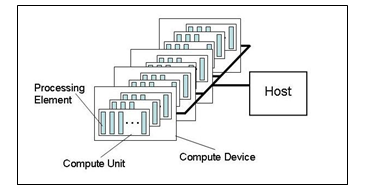

# 3.1 平台模型

OpenCL的平台模型在下面定义。该模型由连接到一个或多个OpenCL设备的主机组成。 OpenCL设备分为一个或多个计算单元（CU, Computer Unit），而这些计算单元又分为一个或多个处理单元（PE, Processing Element）。设备上的计算发生在处理单元内。

OpenCL应用程序实现既包括主机代码也包括设备内核代码。 OpenCL应用程序的主机代码部分根据主机平台的固有模型在主机处理器上运行。 OpenCL应用程序主机代码将内核代码作为命令从主机提交到OpenCL设备。 OpenCL设备在设备内的处理单元上执行命令计算。

OpenCL设备在如何将计算映射到设备处理单元上具有很大的自由度。当同一个CU中的PE在跨PE执行相同的语句序列时，控制流被认为是converged。为在多个PE上执行一条单个的指令流而优化的硬件非常适合converged的控制流。当控制流从一个PE到另一个PE不一样时，则认为时diverged。尽管内核总是以converged的控制流开始执行，但是由于内核中的分支语句，converged和deverged的控制流可能会在单个内核中发生。这为可以使用OpenCL实现的算法提供了很大的灵活性。

图1：平台模型，一个Host连接一个或多个计算设备，每个计算设备中有一个或多个计算单元CU，每个CU由一个或多个处理单元PE组成。

程序员以SPIR-V源二进制、OpenCL C/OpenCL C++源字符串或者实现定义的二进制对象的形式提供程序。OpenCL平台提供了一个编译器，可以将两种形式的程序输入转换为可执行程序对象。设备代码编译可以是在线或离线的。使用标准API在主机程序执行期间可以使用在线编译器。离线编译可以在主机程序控制之外调用特定平台的编译器实现。OpenCL运行时允许开发人员获取先前编译的设备可执行程序，并能够加载和执行先前编译的设备可执行程序。

OpenCL提供两种平台配置：完整配置和功能减少的嵌入式配置。完整配置平台必须为其所有设备提供在线编译器。嵌入式平台可以提供在线编译器，但并非必须如此。

设备可能会将专用功能作为内置函数k开放。平台提供了用于枚举和调用设备提供的内置函数的API，但没有定义其构造或语义。定制设备仅支持内置函数，无法通过内核语言进行编程。

所有设备类型都支持OpenCL执行模型，OpenCL内存模型以及OpenCL中用于管理设备的API。

平台模型是描述OpenCL如何查看硬件的抽象。平台模型的元素与系统中的硬件之间的关系可以是设备的固定属性，也可以是程序的动态功能，具体取决于编译器如何优化代码以最佳地利用物理硬件。